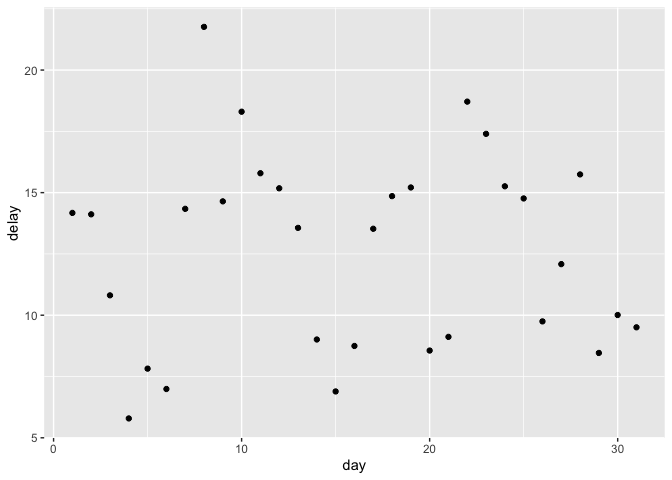
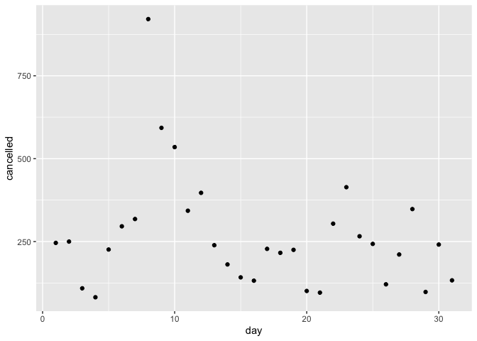

STAT433 - HW2
================
Steven Xia
2/10/2021

[My GitHub Repository Here](https://github.com/sxia35/433-Homework2.git)

``` r
#install.packages("nycflights13")
library(nycflights13)
library(ggplot2)
```

**1) How many flights have a missing dep\_time? What other variables are
missing? What might these rows
    represent?**

``` r
colSums(is.na(flights))
```

    ##           year          month            day       dep_time sched_dep_time 
    ##              0              0              0           8255              0 
    ##      dep_delay       arr_time sched_arr_time      arr_delay        carrier 
    ##           8255           8713              0           9430              0 
    ##         flight        tailnum         origin           dest       air_time 
    ##              0           2512              0              0           9430 
    ##       distance           hour         minute      time_hour 
    ##              0              0              0              0

There are 8255 flights that have a missing dep\_time. The variables
dep\_delay, arr\_time, arr\_delay, tailnum, and air\_time are all
missing as well. We can see the number of missing flights for each of
these variables. We can see that dep\_time and dep\_delay are missing
the same amount of values, so it is safe to assume that there are 8255
flights that did not take off. Furthermore, for arr\_time, arr\_delay,
and air\_time, we can assume that those flights never took off, and
never landed at any airport in NYC.

**2) Currently dep\_time and sched\_dep\_time are convenient to look at,
but hard to compute with because they’re not really continuous numbers.
Convert them to a more convenient representation of number of minutes
since
midnight.**

``` r
flights = mutate(flights, new_dep_time = (dep_time %/% 100)*60 + (dep_time %% 100))
flights = mutate(flights, new_sched_dep_time = (sched_dep_time %/% 100)*60 + (sched_dep_time %% 100))
flightTimes <- select(flights, dep_time, sched_dep_time, new_dep_time, new_sched_dep_time)
head(flightTimes)
```

    ## # A tibble: 6 x 4
    ##   dep_time sched_dep_time new_dep_time new_sched_dep_time
    ##      <int>          <int>        <dbl>              <dbl>
    ## 1      517            515          317                315
    ## 2      533            529          333                329
    ## 3      542            540          342                340
    ## 4      544            545          344                345
    ## 5      554            600          354                360
    ## 6      554            558          354                358

**3) Look at the number of cancelled flights per day. Is there a
pattern? Is the proportion of cancelled flights related to the average
delay? Use multiple dplyr operations, all on one line, concluding with
\`ggplot(aes(x= ,y=)) + geom\_point()’**

From the plots below, we are able to see that there is indeed a direct
relationship between the proportion of cancelled flights and the average
delay. We can see that when the average delay was at its highest point
around the 8th day, the proportion of cancelled flights was also at its
highest. We can also see that the shape of both scatterplots appear to
be quite similar, both plots having two distinct, matching peaks on the
8th and 24th days.

``` r
flights %>% group_by(day) %>%
  summarise(
    delay = mean(dep_delay, na.rm = TRUE)) %>%
  ggplot(aes(x = day, y = delay)) + geom_point()
```

<!-- -->

``` r
flights %>% group_by(day) %>%
  summarise(
    cancelled = sum(is.na(dep_time))) %>%
  ggplot(aes(x = day, y = cancelled)) + geom_point()
```

<!-- -->
